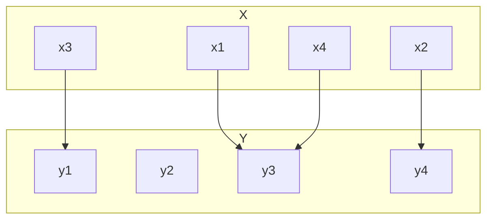

# Question 0.4.8
## Consider the function $f:{1,2,3,4}\rightarrow{1,2,3,4}$ given by the graph below.

![[Pasted image 20220916232008.png]]

|$x$|$1$|$2$|$3$|$4$|
|-|-|-|-|-|
|$y$|$3$|$4$|$1$|$3$|

### 1.  Is $f$ injective? Explain.
Injective means each codomain output value has **at most 1 input**
The input $1$ and $4$ both lead to the output of $3$ so $f$ in this case is $\boxed{\textrm{not injective}}$.

### 2.  Is $f$ surjective? Explain.
Injective means each codomain output value has **at least 1 input**
The output of $2$ isn't used in any of the inputs so $f$ in this case is $\boxed{\textrm{not surjective}}$.

### 3.  Write the function using two-line notation.
####  $$f=\left(^1_3\textrm{ }^2_4\textrm{ }^3_1\textrm{ }^4_3\right)$$